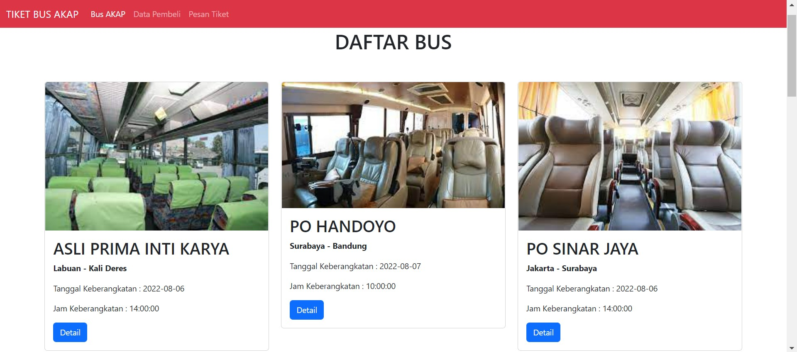
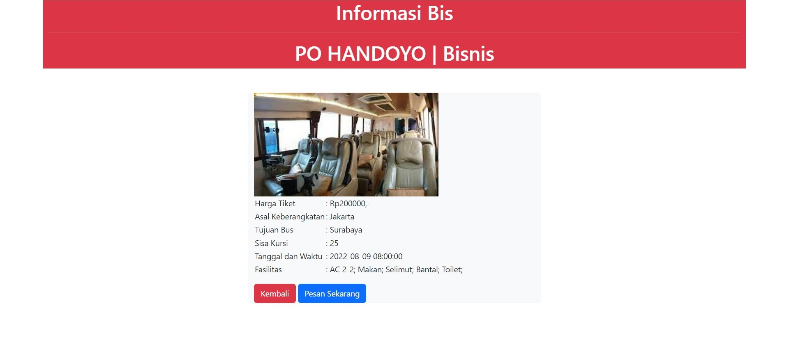
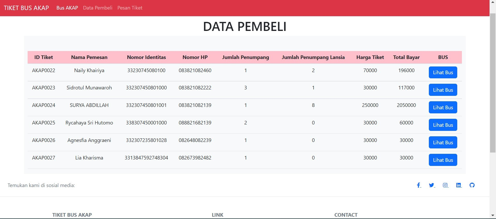
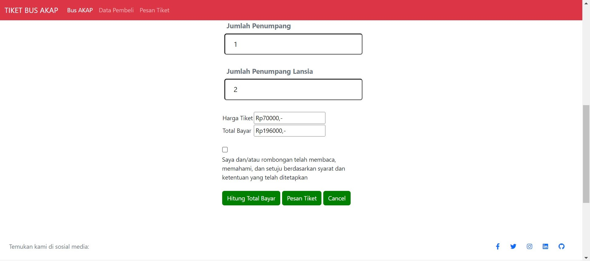
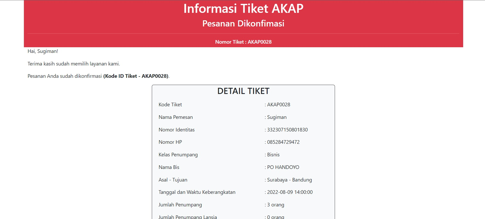
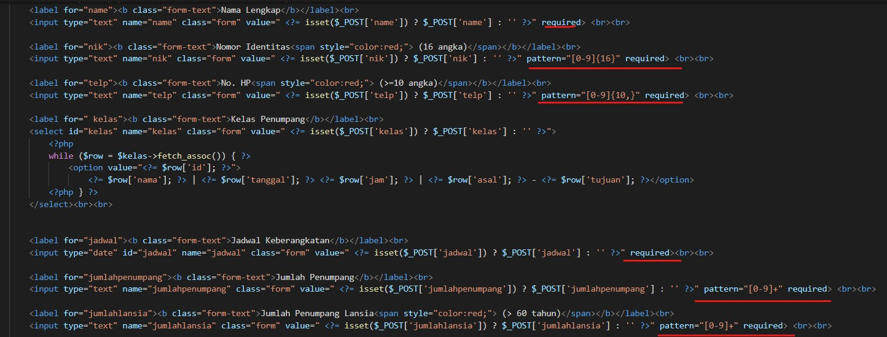
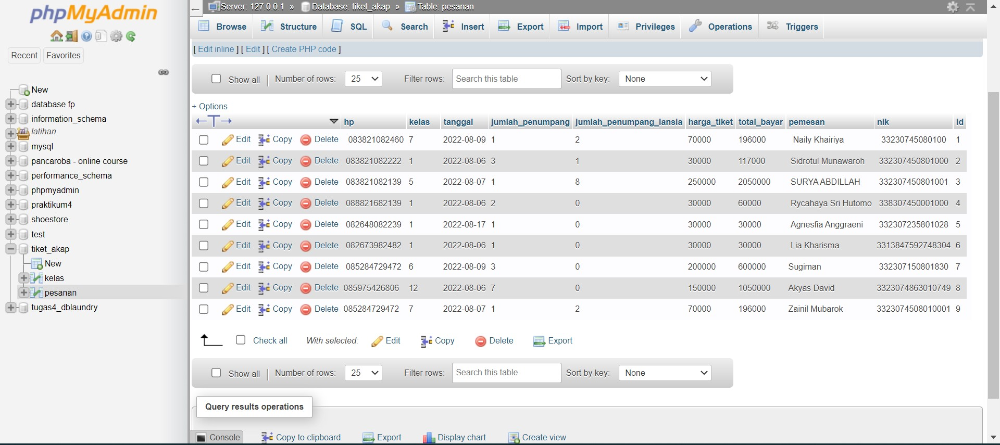
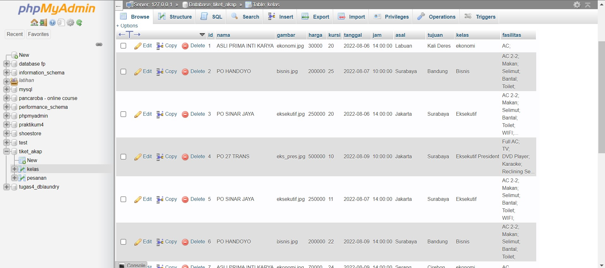
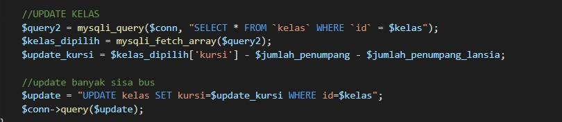
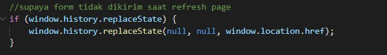

# Program Tiket Bus AKAP

 


Program Tiket Bus AKAP ini merupakan program untuk menampilkan daftar bus yang ada, menampilkan data pembeli, dan menambahkan pesanan bus dengan data-data seperti nama bus, kelas bus, dan total harga tiket. Program ini dibuat menggunakan bahasa pemrograman **HTML (Hypertext Markup Language)**, **CSS (Cascading Style Sheet)**, **PHP (Hypertext Preprocessor)**, serta menggunakan Framework **Bootstrap**.

## Features

1. Menampilkan data bus<br>
   

2. Menampilkan detail bus<br>
   

3. Menampilkan data pesanan (Lebih cocok untuk admin)<br>
   Karena belum ada materi autorisasi dan multirole maka halaman dashboard dan admin belum dibuat<br>
   

4. Menampilkan form pemesanan tiket<br>
   

5. Menghitung total biaya tiket dengan button<br>
   

6. Menampilkan tiket hasil pemesanan<br>
   

7. Validasi Untuk Form seperti untuk NIK (16 Digit), No. HP (berupa angka >= 10 angka), jumlah penumpang(berupa angka), serta wajib untuk diisi semua.<br>
   

8. Tampilan data di MySQL untuk Data Pesanan<br>
   

9. Tampilan data di MySQL untuk Data Bus<br>
   


9. Update sisa kursi<br>
   

9. Pencegahan input form dari hasil refresh page<br>
   


## Structure

Berikut struktur folder dalam aplikasi ini:

```
📦TiketBusAKAP
 ┣ 📂assets
 ┃ ┣ 📜BUS AKAP_ index.php.png
 ┃ ┣ 📜BUS AKAP_ pembeli.php.png
 ┃ ┣ 📜BUS AKAP_ pesan.php.png
 ┃ ┣ 📜BUS AKAP_detail.php.png
 ┃ ┗ 📜BUS AKAP_tiket.php.png
 ┣ 📂css
 ┃ ┗ 📜pesan.css
 ┣ 📂img
 ┃ ┣ 📜bisnis.jpg
 ┃ ┣ 📜data_bus.jpg
 ┃ ┣ 📜data_pembeli.jpg
 ┃ ┣ 📜detail_bus.jpg
 ┃ ┣ 📜ekonomi.jpg
 ┃ ┣ 📜eksekutif.jpg
 ┃ ┣ 📜eks_pres.jpg
 ┃ ┣ 📜form.jpg
 ┃ ┣ 📜hitung.jpg
 ┃ ┣ 📜patas.jpg
 ┃ ┗ 📜tiket.jpg
 ┣ 📂js
 ┃ ┗ 📜script.js
 ┣ 📜database.php
 ┣ 📜detail.php
 ┣ 📜function.php
 ┣ 📜index.php
 ┣ 📜pembeli.php
 ┣ 📜pesan.php
 ┣ 📜README.md
 ┗ 📜tiket.php
```

## Technology

- 
- 
- 
- 
- 

## Requirements

- XAMPP : PHP >= 8.0.0
- Google Chrome >= 89.0.4389.114
- MySQL >= 5.7


## Instalation

- XAMPP

  Download [XAMPP](https://www.apachefriends.org/download.html) sesuai OS (Operating System) masing-masing, kemudian install sesuai petunjuk.

- Google Chrome
  Download [chrome](https://www.google.com/intl/id/chrome/browser-tools/) sesuai OS (Operating System) masing-masing, kemudian install sesuai petunjuk.

## Usage

1. Letakan folder **TiketBusAkap** ke dalam
   > _C:\xampp\htdocs_ (Windows).
2. Jalankan _XAMPP -> Apache_.
3. Jalankan _XAMPP -> MySQL_.
4. Import _tiket_akap.sql_ ke MySQL
5. Buka Browser ketikkan
   > _http://localhost:8080/TiketBusAkap/index.php_.

## Acknowledgments
[Font Awesome](https://fontawesome.com/)

## Credits

Author: Naily Khairiya

## Contact :
Naily Khairiya - nailykhairiya@gmail.com 
- [Whatsapps](https://wa.me/+6283821082460)
- [Github](https://github.com/nailykhry)
- [Linked In](https://www.linkedin.com/in/nailykhairiya/)
